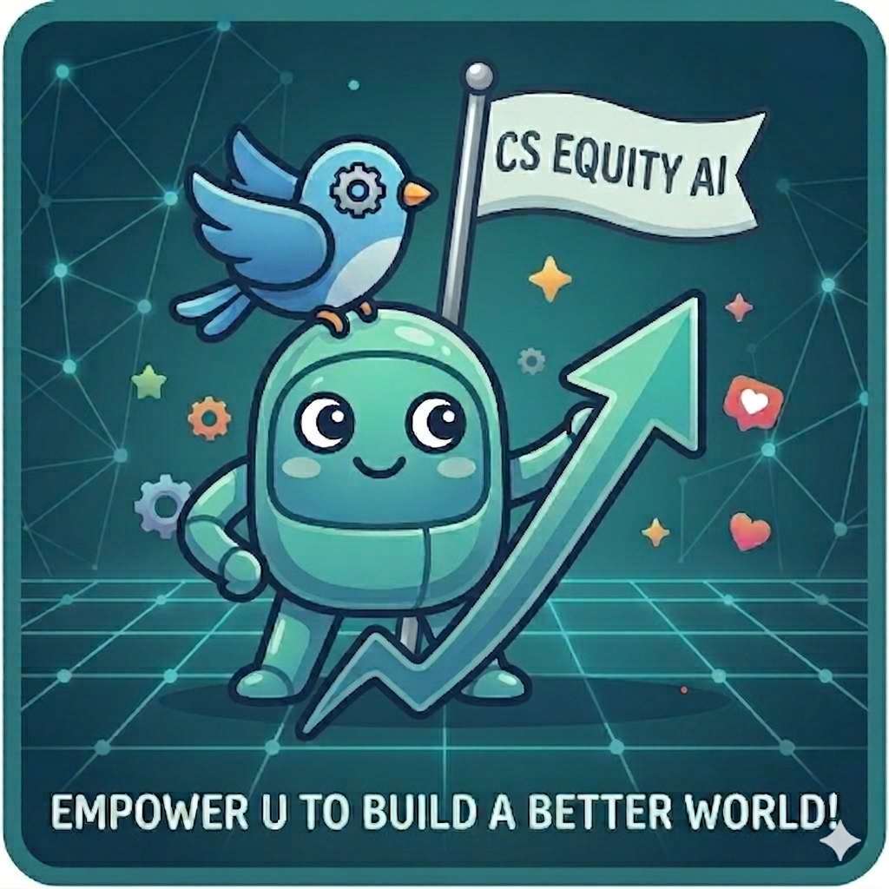
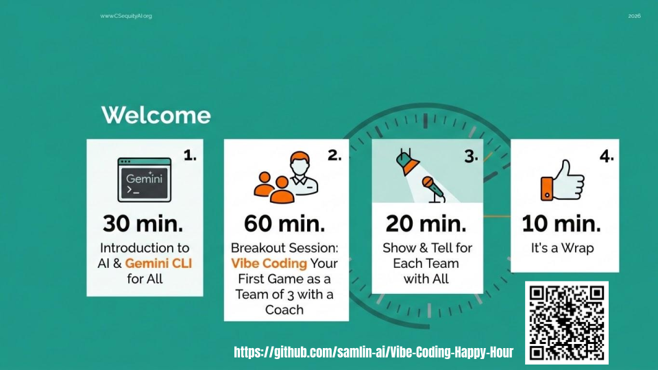
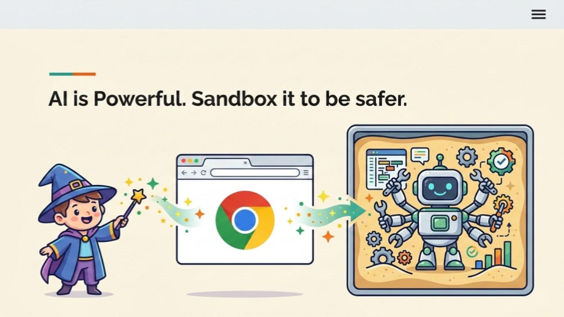
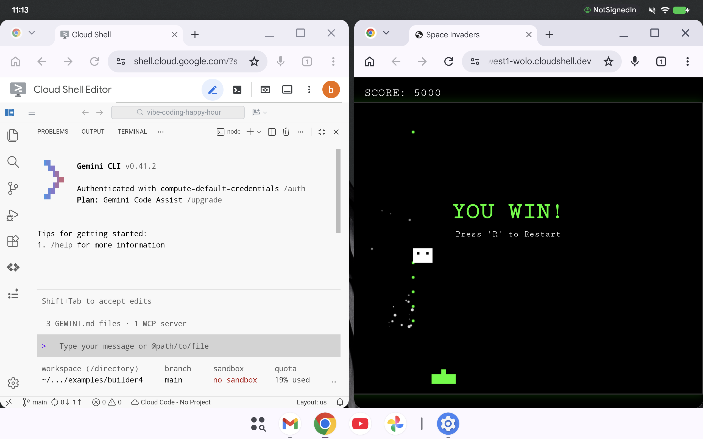
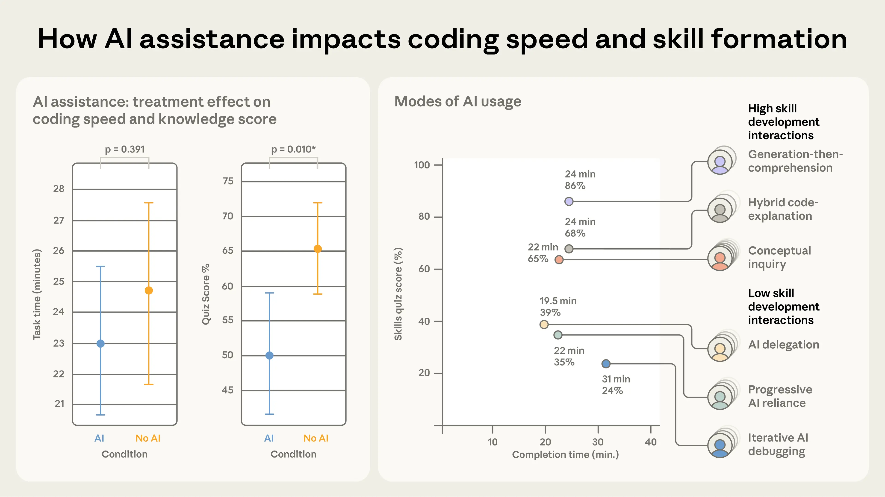

# Vibe Coding Happy Hour
This is a course to grow K12 students to become AI-native builders, starting from vibe coding their first game. 

**Brought to you by: [CSequityAI.org](https://www.csequityai.org/)**

---

## Goals

1. Spark their curiosity by having fun making games.
2. Build hands-on experience with not only vibe coding but also AI-augmented understanding, to be ready for the brave new world.
3. Practice technical collaboration skills as a team of 3–5.
4. Practice technical communication skills through Show & Tell.

---

## Examples

Check out these games to see what kids will build: https://samlin-ai.github.io/vibe-coding-happy-hour/

## 2-Hour Course

1. **30 min — Introduction to AI & Gemini CLI** for all on Google Meet.
    - The lead coach kicks off the event according to [the lead coach guide](./lead-coach-guide-intro.md).
2. **60 min — Breakout Session: Vibe Coding Your First Game**
    - 3–5 students with 1 coach, in person or virtually in a breakout room.
    - A coach guides the team to build their first game according to [the instructions](./coach-guide-gemini-cli.md).
3. **20 min — Show & Tell** for each team with all.
4. **10 min — It's a Wrap**

---

## Why Use the CLI for K12?

1. **Reduced friction**: No more manual copy-pasting. If they want a change, they run the command again or use a "fix" command.
2. **Tech literacy**: Students learn basic file system navigation (`cd`, `ls`, `mkdir`) while doing something fun.
3. **Automation**: They see how AI can be used as a tool inside other programs, rather than just a chatbot.

---

## Development Environment

Before the class, set up the development environment according to [dev-env-setup.md](./dev-env-setup.md).

### Vibe Coding on Pixel Tablet and Google Cloud Shell Editor

---

## Coaching Tips for Success

### AI-Augmented Understanding

1. Challenge students to use a "generation-then-comprehension" approach: let the AI generate the code, but follow up with specific questions to ensure they fully understand the logic before they move on.
2. Focus on conceptual inquiries: one of the most effective and efficient ways to use AI is to ask conceptual questions.

Source: [How AI Impacts Skill Formation: 6 AI interaction personas](https://www.anthropic.com/research/AI-assistance-coding-skills)

#### Examples

> "Please explain how the game works to a 7-year-old."

> "Please explain the design with an ASCII diagram."

> "Please explain the change and trade-offs."

### The "Rubber Duck" Method

If a student is stuck, ask them to "vibe" it out loud to you: *"What do you want to happen when the taco hits the floor?"* Once they say it, tell them: *"Great — now tell Gemini exactly that."*

### Handling "Hallucinations"

Sometimes Gemini might suggest a complex library. Remind students to ask for "no other framework, please" to keep the project simple and easy to read.

- For example, if Gemini CLI tries to use npm or any tools not yet installed, just say: *"Please don't use npm or any framework."*

### The "Show and Tell"

In the last 15 minutes, have every student "playtest" another student's game. This builds a sense of community and lets them see different "vibes" in action.

### "Cheat Sheet" to "Prompt" Students

Coach students not just to use AI to complete tasks, but also to use AI to augment their understanding.

- *"How do I add a 'Start Game' button so the game doesn't begin immediately?"*
- *"Can you explain what this part of the code does in plain English?"* (Great for learning while doing!)

---
