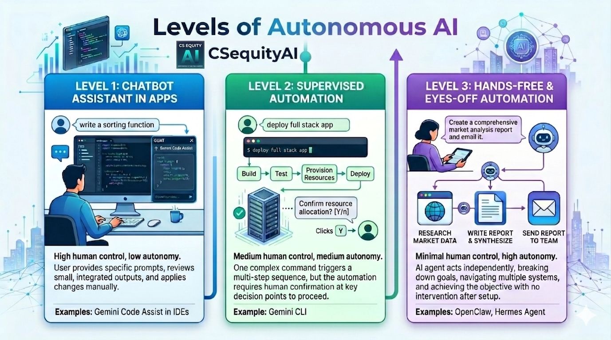

# Vibe Coding 歡樂時光

[English](./README.md) | 繁體中文

這是一門幫助 K12 學生成長為 AI 原生創作者（AI-native builders）的課程，從 vibe coding 他們的第一款遊戲開始。

**主辦單位：[CSequityAI.org](https://www.csequityai.org/)**

## 目標

1. 透過開心做遊戲，點燃孩子的好奇心。
2. 累積實作經驗——不只是 vibe coding，還有 AI 輔助理解（AI-augmented understanding），為美麗新世界做好準備。
3. 以 3–5 人小組練習技術協作能力。
4. 透過成果發表（Show & Tell）練習技術溝通能力。

### 範例

看看這些遊戲，了解孩子們會做出什麼：https://samlin-ai.github.io/vibe-coding-happy-hour/

### 為什麼使用 Gemini CLI？

1. **減少阻力**：不用再手動複製貼上。想改東西時，再下一次指令或用「fix」指令即可。
2. **科技素養**：學生在玩樂中學會基本的檔案系統操作（`cd`、`ls`、`mkdir`）。
3. **自動化**：邁向超越聊天機器人的第二級自主性（Level 2 Autonomy）。孩子們會學到 AI 不只能生成答案，還能執行任務。

## 兩小時課程

1. **30 分鐘 — AI 與 Gemini CLI 入門**：全體在 Google Meet 上進行。
    - 主帶領教練依照[主帶領教練指南](./lead-coach-guide-intro.zh-TW.md)開場。
2. **60 分鐘 — 分組時段：Vibe Coding 你的第一款遊戲**
    - 3–5 位學生搭配 1 位教練，實體或在線上分組討論室進行。
    - 教練依照[教練指南](./coach-guide-gemini-cli.zh-TW.md)帶領小組打造第一款遊戲。
3. **20 分鐘 — 成果發表（Show & Tell）**：各組向全體展示。
4. **10 分鐘 — 圓滿落幕**

**[簡報](https://docs.google.com/presentation/d/1iEOEp5ueOGOGqUgtvu-DLNjHJp_gqi1zeQ7scHNBYZ0/edit?usp=sharing)**

## 開發環境

課前請依照 [dev-env-setup.zh-TW.md](./dev-env-setup.zh-TW.md) 設定好開發環境。

### Google Cloud Sandbox 設定與示範影片

### 在 Pixel 平板與 Google Cloud Shell 編輯器上 Vibe Coding

## 成功教學秘訣

### AI 輔助理解

1. 鼓勵學生採用「先生成、後理解」的方式：讓 AI 生成程式碼，但接著提出具體問題，確保自己完全理解邏輯後再繼續。
2. 著重概念性提問：使用 AI 最有效率的方式之一，就是問概念性的問題。

資料來源：[How AI Impacts Skill Formation: 6 AI interaction personas](https://www.anthropic.com/research/AI-assistance-coding-skills)

#### 範例

> 「請用 7 歲小朋友能懂的方式解釋這個遊戲怎麼運作。」

> 「請用 ASCII 圖解釋這個設計。」

> 「請解釋這次修改的內容與取捨。」

### 「橡皮鴨」方法

如果學生卡住了，請他大聲對你「講出感覺」：*「你希望墨西哥捲餅掉到地板時發生什麼事？」*等他說出口後，告訴他：*「很好——現在把這句話原封不動告訴 Gemini。」*

### 處理「幻覺」

有時 Gemini 會建議使用複雜的函式庫。提醒學生加上「請不要用其他框架」，讓專案保持簡單易讀。

- 例如，如果 Gemini CLI 嘗試使用 npm 或任何尚未安裝的工具，直接說：*「請不要使用 npm 或任何框架。」*

### 成果發表（Show and Tell）

在最後 15 分鐘，讓每位學生「試玩」另一位學生的遊戲。這能建立社群感，也讓他們看到不同的「vibe」如何呈現。

### 「提示」學生的小抄

引導學生不只用 AI 完成任務，也要用 AI 加深理解。

- *「我要怎麼加一個『開始遊戲』按鈕，讓遊戲不會馬上開始？」*
- *「你可以用白話解釋這段程式碼在做什麼嗎？」*（邊做邊學的好方法！）

---
