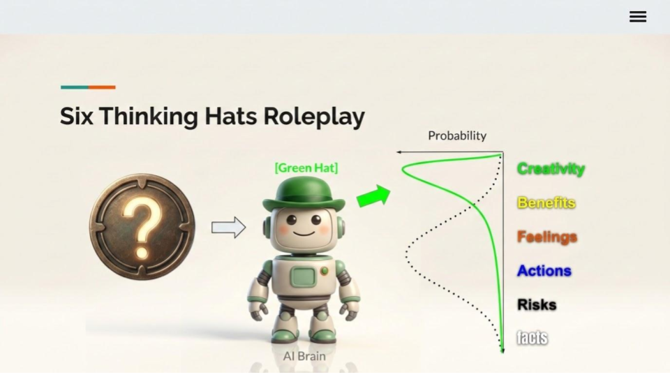

# Coach Guide: Kids' First Vibe Coding Game with Gemini CLI
**Audience:** Kids (ages 8–14) + breakout coach | **Team size:** 3–5 kids | **Duration:** 60 minutes

---

## Key Results

The coach not only guides the team in working together to deliver these key results, but also challenges them to go above and beyond.

1. [ ] Name the team.
2. [ ] Brainstorm the idea of the game and the prompts.
3. [ ] Brainstorm the improvements and the prompts.
4. [ ] Understand how the game works and its design.
5. [ ] Rehearse the Show & Tell.

---

## Before the Session

Follow [dev-env-setup.md](./dev-env-setup.md) to set it up.

---

## Session Timeline

**Coach tip:** Segment 4 — Make It Yours is nice to have. Feel free to spend more or less time on it according to team's progess. It's better for team to build a game and get ready for Show & Tell.

### Segment 1 — Builders Assemble (0:00–0:05)

**Goal:** Get the kids to know each other and name the team together.

---

### Segment 2 — Ignite the Idea (0:05–0:15)

**Goal:** Get the kids excited and pick a name and a game concept together.

**Say to the team:**
> "You are all game designers today. In one hour, you will build a real game that anyone can play. The AI will write the code — your job is to tell it WHAT to build."

**Activity — 3-minute think alone and brainstorm together:**

1. Ask each kid to think and write down their answer on a sticky note by themselves for a minute: *"What is your favorite game?"*
2. Each kid shares their answer, then group them as a team.
3. Vote by show of hands to pick the top two.
4. Combine the top two into a new game as a group.

**Coach tip:** Combining thinking alone with brainstorming collaboratively (a "hybrid" approach) can generate even better ideas as a team and avoid group thinking.

---

### Segment 3 — Build the First Version (0:15–0:35)

**Goal:** Get a working game on screen in 20 minutes.

**Step 1 — Generate the game (kids take turns to prompt):**

For example:
```
Build a simple Tetris web game without frameworks.
```

**Step 2 — Open in browser for each kid to play**

**Coach tip:** If the game doesn't work, don't panic! Say: *"Even professional developers get bugs. Let's ask Gemini CLI to fix it — that's the vibe coding superpower."*

**Quick fix prompt template:**
```
The game has a bug: [describe what's wrong in plain English].
Please fix it.
```

**Step 3 — Commit the change**

Git is the time machine of your code. It tracks all changes you commit to. So, you and AI have the complete history of the jounery.

Let's commit each change by: [Source Control] > Use the prompt as the Message > [Commit]

**Coach tip:** Open [Use version control](https://docs.cloud.google.com/shell/docs/version-control) to give a quick overview if there is time.

---

### Segment 4 — Make It Yours (0:35–0:45)

**Goal:** Each kid adds one personal touch. This is where creativity explodes.

**Go around the team. Each kid picks ONE upgrade:**

Prompt examples the kids can mix and match:
```
Add a fun sound effect when the player scores a point.
```
```
Add a countdown timer that starts at 30 seconds.
```
```
Make the player character an emoji like 🐸 instead of a square.
```
```
Add a high score that saves between games.
```
```
Make the game faster every 10 points.
```
```
Change the background color to [COLOR] and the font to something fun.
```
```
Add a "Play Again" button on the Game Over screen.
```

**Coach tip:** Let the Prompt Writer read each upgrade request to the group before typing it. This keeps everyone involved and lets kids catch misunderstandings before they happen. 

---

### Segment 5 — Understand the Game (0:45–0:53)

**Goal:** Understand how the game works and is built.

Guide kids try to answer these questions before asking Gemini.

1. Ask the team to think and guess how the game works.
2. Open index.html, and other generated files for a quick look.
3. To explain how the game works to an [x]-year-old.
4. Draw an ASCII system diagram to explain how the game works. And then, ask follow-up questions.

---

### Segment 6 — Rehearse Show & Tell (0:53–1:00)

**Goal:** Celebrate what they built and reflect.

**Demo the game:**
- Let each kid play for 30 seconds
- The Note Taker reads out all the features they added
- Take a group photo or screenshot

**Debrief questions (pick 2–3):**
1. *"What was the hardest part? How did you solve it?"*
2. *"What would you add if you had one more hour?"*
3. *"Who wrote the code — you or the AI? Who was in charge?"* (They were!)
4. *"Where else could you use an AI assistant like this?"*

**Give out the win:**
> "You just built a real game. You are officially game mackers."

---

## Handling Common Situations

### "Gemini gave us weird code / it didn't work"
Be matter-of-fact: bugs are normal. Use this prompt:
```
That didn't work as expected. [Describe the problem].
Can you try a simpler approach?
```

### "The kids are arguing about what feature to add"
Use the voting rule: each kid gets one vote, majority wins. Ties go to the Game Designer role.

### "A kid says 'I can't do this, I don't know how to code'"
Reply: *"That's the whole point — you don't need to! You just tell the AI what you want in plain English. You already did it."*

### "We're running out of time"
Skip Segment 4 upgrades. Go straight to Show & Tell at 0:45. A working game beats an unfinished fancy one.

### "We have extra time"
Ask: *"Should we add a two-player mode? Let's ask Gemini!"*

---

## Quick Reference: Useful Gemini CLI Prompts

```
# Start a new game from scratch
We are kids making a [TYPE] game. Create index.html with HTML/CSS/JS only.

# Fix a bug
There is a bug: [describe it]. Fix index.html and show the full updated file.

# Add a feature
Add [FEATURE] to our game. Show the updated index.html.

# Explain something
Explain in simple words for a 10-year-old: what does [CODE PART] do?

# Ask for ideas
What are 3 fun things we could add to our [TYPE] game? Keep it simple.

# Make it look better
Make the game look more colorful and exciting. Use bright colors and emojis.
```

---

## What Success Looks Like

By the end of the hour, the team should have:
- A playable game open in the browser
- At least one feature each kid contributed
- An experience of iterating with AI (prompt → test → improve)
- Confidence that they can build things with code

The game doesn't have to be perfect. **Shipped beats perfect.**

---

## Bonuses

Try these when the team has extra time.

### Question 1: How to cast better spells (aka prompting)?

**"Role, Goal, Context"** Prompting Framework
> "You are an expert game developer. Please build a simple web game where a panda catches falling tacos. It should be colorful, fun, and work in a browser."

Ask follow-up questions, such as:
> "Why does this framework work better?"

Hint: how is this like **the Six Thinking Hats role-playing**? Because **Attention Is All You Need**.



---

### Question 2: How to beat AI at its own game?

**Meta Prompting** — just ask it to level up your prompt:
> "You are the best prompt engineer. Please create a prompt to build a simple web game where a panda catches falling tacos. The game should be colorful, fun, and work in a browser."

---
