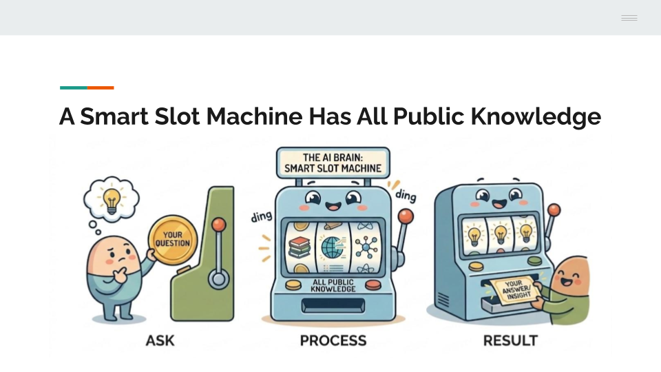
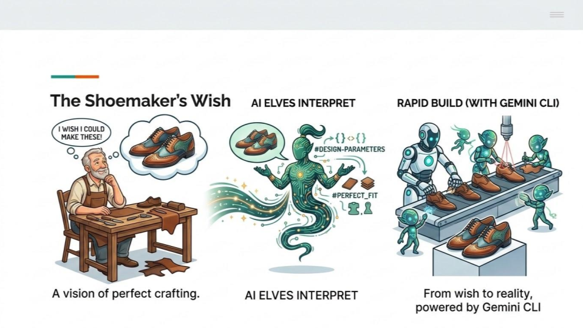

# Lead Coach Guide: Introduction to AI & Gemini CLI
**Audience:** All kids (ages 8–14) + breakout coaches | **Format:** Google Meet (everyone) | **Duration:** 30 minutes

---

## Key Results

The lead coach kicks off the event and introduces AI and Gemini CLI to get everyone ready for the vibe coding breakout session.

1. [ ] Everyone feels welcomed and excited.
2. [ ] Kids know what AI is and how to use Gemini CLI.
3. [ ] Kids get some ideas for vibe coding games from a few examples.
4. [ ] Kids know their breakout room and the Show & Tell expectation.
5. [ ] Coaches have been introduced by name.

---

## Before the Session

Follow [dev-env-setup.md](./dev-env-setup.md) to set it up.

---

## Session Timeline

### Segment 1 — Welcome & Energy (0:00–0:05)

**Goal:** Set the tone. Loud, friendly, kid-energy. Get every camera on.

**Say to everyone:**
> "Welcome to Vibe Coding Happy Hour! In the next two hours, you are going to build a real game — one you can play, share, and show off. Not a worksheet. A real game."

**Activity — Roll call wave:**
1. Ask kids to turn cameras on and wave.
2. Quick poll in chat: *"Type one game you love."* (Coach reads a few aloud.)
3. Introduce yourself in one sentence: name, where you're from, your favorite game as a kid.

**Coach tip:** Don't lecture. Energy now sets the tone for the whole two hours. If kids are quiet, ask: *"Who has played a game today already?"* — hands always go up.

---

### Segment 2 — What is AI, Really? (0:05–0:12)

**Goal:** Give a kid-sized mental model of AI. No jargon.



**Say to everyone:**
> "AI is a helper with all the world's knowledge. It reads what you type, does the tasks, and reports back. It can write stories, answer questions, and — this is the cool part — it can also write computer code. Today we're going to be the architects. AI will be our masons. We tell it what to build."

**Activity — Two questions, hands up:**
1. *"Who has used AI before? Maybe ChatGPT, Gemini, or anything else?"* (Most hands go up.)
2. *"Who has used AI to make something — not just answer a question?"* (Fewer hands. That's today.)

**The one big idea — say it slowly:**
> "AI is good at doing. You are good at deciding. Today you decide what game to make, and AI codes it."

**Coach tip:** Resist explaining neural networks, LLMs, or training data. A 10-year-old needs the *role* of AI, not the *mechanics* of AI.

---

### Segment 3 — Live Demo: Gemini CLI Builds a Game (0:12–0:22)

**Goal:** Show, don't tell. By the end of this segment, every kid has watched a game appear on screen from a single sentence.



**Say to everyone:**
> "I'm going to cast spells in English. Watch what happens."

**Step 1 — Type the prompt live (kids can read along):**
```
Build a Space Invaders web game without frameworks.
```

**Step 2 — While Gemini is generating, narrate:**
> "Notice I didn't write any code. I wrote a sentence — like a text message. AI is reading it right now and writing the code for me."

**Step 3 — Open `index.html` in the browser and play it for 20 seconds.**

**Step 4 — The takeaway (say it after the demo):**
> "That's it. That's vibe coding. You describe. AI builds. You decide if it's good. You ask for changes. Repeat."

---

### Segment 4 — How Your Hour Will Work (0:22–0:27)

**Goal:** Every kid leaves knowing exactly what happens in their breakout.

**Say to everyone:**
> "In a minute, we're sending you into smaller rooms — 3 to 5 kids per room with one coach. You'll have 60 minutes to build your own game as a team."

**Set the show & tell expectation:**
> "After your hour, every team comes back here. Each team gets to demo their game to everyone. That's the finish line."

**Introduce the breakout coaches by name:**
> "Your coaches today are [Coach A], [Coach B], [Coach C]. Wave when I say your name."

---

### Segment 5 — Send-Off (0:27–0:30)

**Goal:** High energy hand-off into breakouts.

**Say to everyone:**
> "Three rules for the next hour:
> 1. **You are the boss.** AI works for you.
> 2. **Bugs are normal.** When something breaks, ask Gemini to fix it.
> 3. **Shipped beats perfect.** A finished simple game wins over a fancy unfinished one."

**Final pump:**
> "When I say go, you'll move into your breakout rooms. Your coach will be waiting. Ready? GO!"

**Move kids into breakout rooms.**

---

## Handling Common Situations

### "Kids are quiet, no one is answering"
Call on specific kids by name from the participant list. *"Maya, what's a game you love?"* Direct calls beat open questions every time.

### "The live demo breaks or hangs"
Don't hide it. Say: *"Perfect — this is what real coding looks like. Watch how we fix it."* Then ask Gemini to debug. This is one of the most valuable things kids can see.

### "A kid asks a deep question (How does AI think? Is it alive?)"
Give a one-sentence answer and park it: *"Great question — AI is really good at guessing the next word, like a super-smart autocomplete. Hold that question for your breakout coach."*

### "We're running over on the demo"
Cut Segment 3 Step 4 (the kid suggestion). Go straight to the takeaway. Time discipline here protects the breakout hour.

### "Tech issues — screen share fails"
Skip the live demo. Describe what would have happened, then say: *"Your coach will run a live demo with just your team in the breakout room."* Move on. Don't burn 5 minutes on a fix.

### "A coach is missing"
Merge their kids into another room. Better to have 6–7 kids with one coach than kids with no coach.

---

## Key Phrases to Use Throughout

| Moment | What to Say |
|--------|-------------|
| Opening | *"You're going to build a real game today."* |
| Defining AI | *"AI does the typing. You do the deciding."* |
| Before the demo | *"Watch what one sentence can do."* |
| After the demo | *"You can do this too. That's the whole point."* |
| Sending to breakouts | *"Shipped beats perfect. Go build."* |

---

## What Success Looks Like

By the end of these 30 minutes:
- Every kid is on camera and has spoken or typed at least once
- Every kid has watched a game be built from a sentence
- Every kid knows their breakout room and coach
- Every kid believes *they* can do what they just saw

The intro doesn't need to teach everything. It needs to make kids want to start. **Shipped beats perfect.**

---
